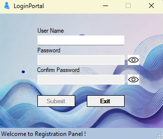

# User Management UI - LoginPortal

This project is a user management interface designed to handle basic operations like user login, registration, and password reset. Users can configure their own databases by editing the connection settings in the configuration file, making it adaptable to various environments.

## Features

- **User Login**: Allows users to log in with their credentials.
- **User Registration**: Enables new users to register with unique credentials.
- **Password Reset**: Provides a password reset feature if users forget their login credentials.
- **"Remember Me" Functionality**: Saves username for quicker login in future sessions if the option is selected.
- **Database Flexibility**: Supports user-specific database configuration through the App.config file.

# Application Screens

## Login Screen


This screen is the panel where users log in to the system. In addition to the username and password fields, it includes:

- **Remember Me**: Saves the user's login information for automatic filling in the next session.
- **Forget Password**: Redirects to the password reset screen.
- **Sign In and Sign Up buttons**: Used to log in or create a new account.
- **StatusStrip**: Displays messages to inform the user about the login process (e.g., "Login successful" or "Incorrect username or password").

## Registration Screen


This screen is used to create a new user account. It includes the following fields:

- **User Name**: The new username.
- **Password and Confirm Password**: Password fields entered twice to confirm the new password.
- **Submit**: Saves the new user information.
- **Exit**: Exits the registration panel.
- **StatusStrip**: Displays messages about the registration process (e.g., "Registration successful" or "Passwords do not match").

## Password Reset Screen


This screen is used for resetting forgotten passwords. It includes the following fields:

- **User Name and Old Password**: Used to verify the user's identity.
- **New Password and Confirm New Password**: The new password entered twice for confirmation.
- **Reset Password**: Resets the password.
- **Exit**: Exits the password reset panel.
- **StatusStrip**: Provides feedback during the password reset process (e.g., "Password reset successful" or "Old password incorrect").

## Installation

1. **Clone the Repository**:
   ```bash
   git clone https://github.com/yourusername/yourprojectname.git
   ```

2. **Open in Visual Studio**:
   Open the solution file (.sln) in Visual Studio.

3. **Database Configuration**:
   Update the connection string in the `App.config` file to point to your own database. Replace `User ID` and `Password` with your database credentials.

   ```xml
   <connectionStrings>
       <add name="UserDatabase"
            connectionString="Data Source=localhost;Initial Catalog=UserManagement;User ID=YourUserID;Password=YourPassword;"
            providerName="System.Data.SqlClient" />
   </connectionStrings>
   ```

4. **Build and Run**:
   Build the project and run it in Visual Studio to start the application.

## Usage

- **Logging In**: Enter your username and password to log in. If you are an admin, you will see a message welcoming you to the admin dashboard.
- **Remember Me**: Selecting "Remember Me" will store your username for future sessions.
- **Registering**: Click the "Sign Up" button and fill in the required fields to create a new account.
- **Reset Password**: Use the "Forget Password" link to reset your password if you've forgotten it.

## Configuration Details

### App.config File

The `App.config` file holds the connection string that allows you to configure your database. Adjust this file with your own `DataSource`, `InitialCatalog`, `User ID`, and `Password` as needed. 

Example connection string:

```xml
<connectionStrings>
    <add name="UserDatabase"
         connectionString="Data Source=localhost;Initial Catalog=UserManagement;User ID=YourUserID;Password=YourPassword;"
         providerName="System.Data.SqlClient" />
</connectionStrings>
```

## Requirements

- **.NET Framework**: This application requires .NET Framework version 4.8.
- **SQL Server**: A SQL Server database with a `UserManagement` table structure is expected for this application to function properly.

## Troubleshooting

- **NullReferenceException**: Ensure the `App.config` file contains the correct connection string.
- **Database Connection Issues**: Confirm that the SQL Server instance is accessible and that the `User ID` and `Password` provided in the `App.config` file are correct.

## Contributing

Feel free to fork this repository, make improvements, and submit pull requests. Any contributions to enhance functionality or address bugs are welcome.

## License

This project is licensed under the MIT License.
